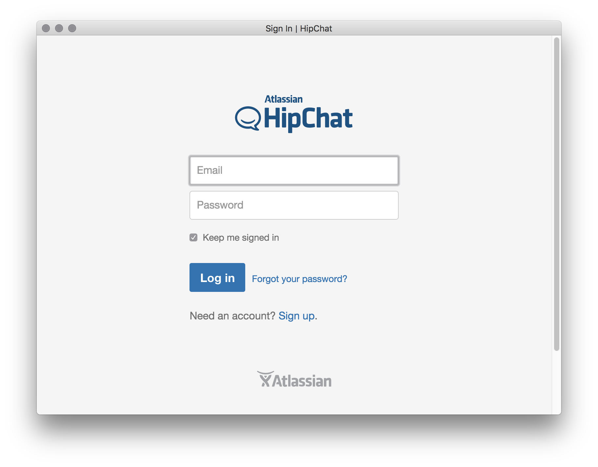

# HipsterChat

> Unofficial HipChat app

*OS X 10.8+, Windows 7+ & Linux are supported.*

## Install

### OS X

[**Download**](https://github.com/kvasir/HipsterChat/raw/master/dist/HipsterChat-osx-0.0.0.zip), unzip, and move `HipsterChat.app` to the `/Applications` directory.

### Linux

[**Download**](https://github.com/kvasir/HipsterChat/raw/master/dist/HipsterChat-linux-0.0.0.zip) and unzip to some location.

### Windows

[**Download**](https://github.com/kvasir/HipsterChat/raw/master/dist/HipsterChat-windows-0.0.0.zip) and unzip to some location.

## Dev

Builds the app for OS X, Linux, and Windows, using [electron-packager](https://github.com/maxogden/electron-packager).

###### Commands

- Init: `$ npm install`
- Run: `$ npm start`
- Build OS X: `$ npm run build-osx`
- Build Linux: `$ npm run build-linux`
- Build Windows: `$ npm run build-windows`
- Build all: `$ brew install wine` and `$ npm run build` *(OS X only)*

## License

MIT © [Kvasir](https://github.com/kvasir)
